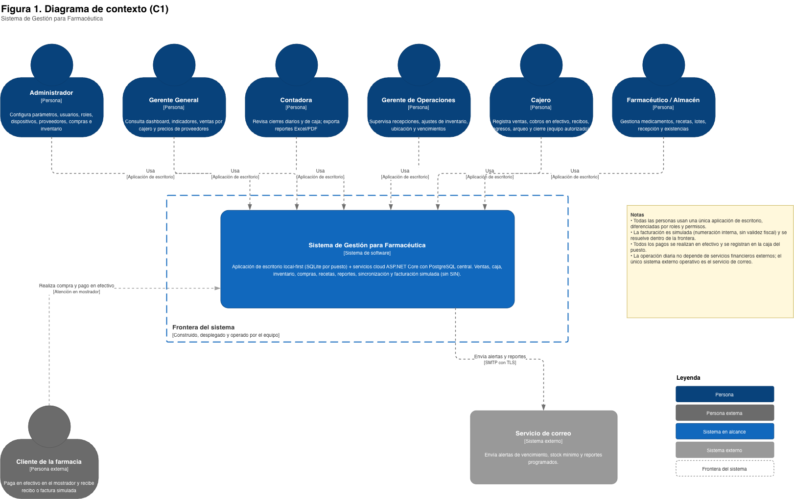
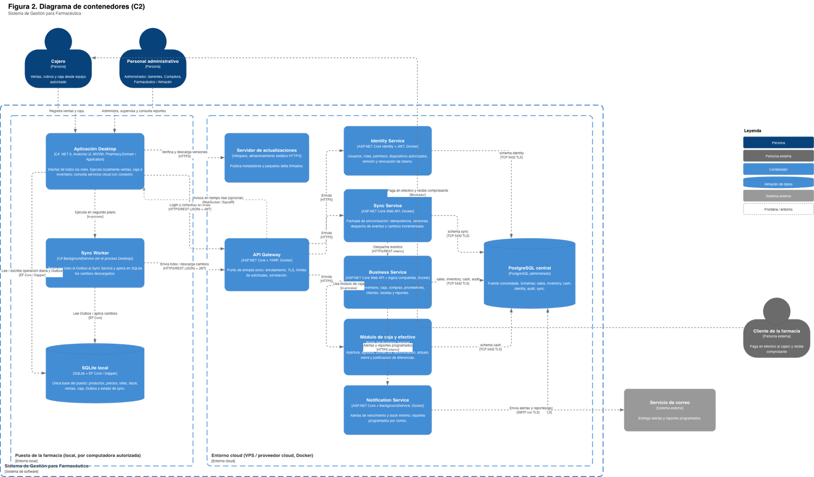
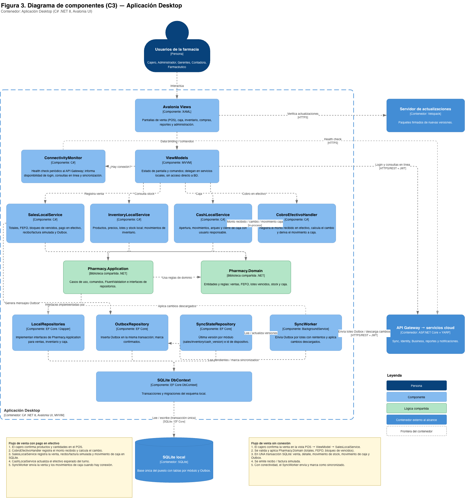
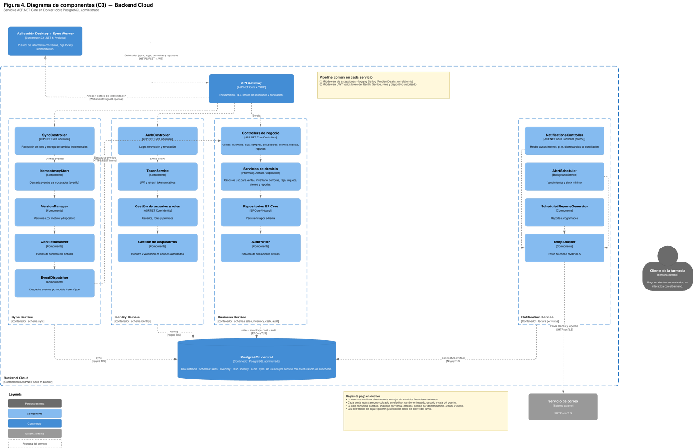

# Modelos C4

Diagramas del modelo C4 del **Sistema de Gestión para Farmacéutica**, niveles 1
al 3. Corresponden a las Figuras 1 a 4 del Documento 3
([`docs/arquitectura/`](../../docs/arquitectura/)).

| Nivel | Diagrama | Fuente editable | Imagen | Código |
| --- | --- | --- | --- | --- |
| 1 — Contexto | Sistema, personas y sistemas externos | `c4-1-contexto.drawio` | `c4-1-contexto.png` | `LGS-MOD-C4-1` |
| 2 — Contenedores | Entorno local y entorno cloud | `c4-2-contenedores.drawio` | `c4-2-contenedores.png` | `LGS-MOD-C4-2` |
| 3 — Componentes | Aplicación Desktop | `c4-3a-componentes-desktop.drawio` | `c4-3a-componentes-desktop.png` | `LGS-MOD-C4-3A` |
| 3 — Componentes | Backend Cloud | `c4-3b-componentes-backend.drawio` | `c4-3b-componentes-backend.png` | `LGS-MOD-C4-3B` |

## Contexto (nivel 1)

## Contenedores (nivel 2)

## Componentes — Aplicación Desktop (nivel 3)

## Componentes — Backend Cloud (nivel 3)

## Notación

- Personas en azul oscuro; personas externas (cliente) en gris oscuro.
- Sistema y contenedores en azul; componentes en azul claro; lógica
  compartida (`Pharmacy.Domain`, `Pharmacy.Application`) en verde.
- Sistemas externos en gris. La única dependencia externa es el servicio de
  correo: todos los pagos son en efectivo y no hay pasarela de pagos.
- Cada relación indica su propósito y, entre corchetes, la tecnología o
  protocolo.

## Edición

Los `.drawio` se abren con [draw.io / diagrams.net](https://app.diagrams.net).
Después de editar uno, exporte la imagen con **Archivo → Exportar como → PNG**
(escala 200 %) y reemplace el `.png` del mismo nombre.

Las plantillas TikZ (`c4-contexto.tex`, `c4-contenedores.tex`,
`c4-componentes.tex`) se conservan como plantilla institucional de Legasoft; los
diagramas vigentes del proyecto son los `.drawio`.
